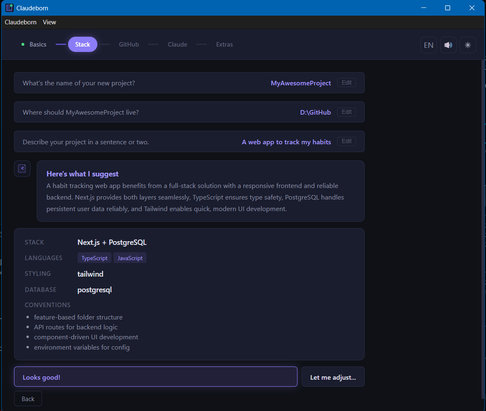
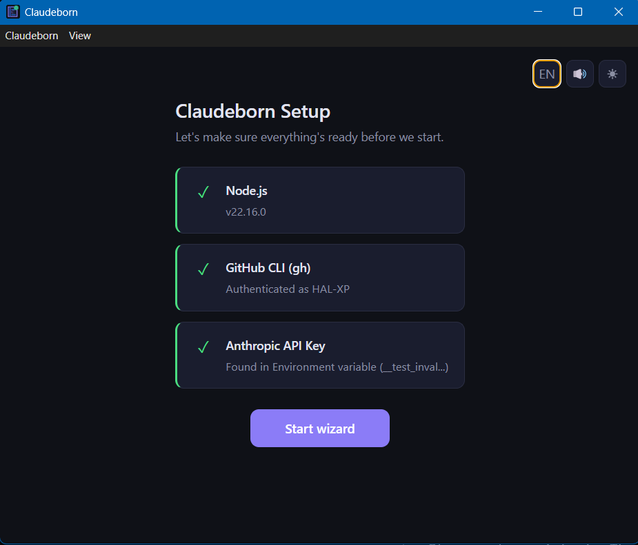
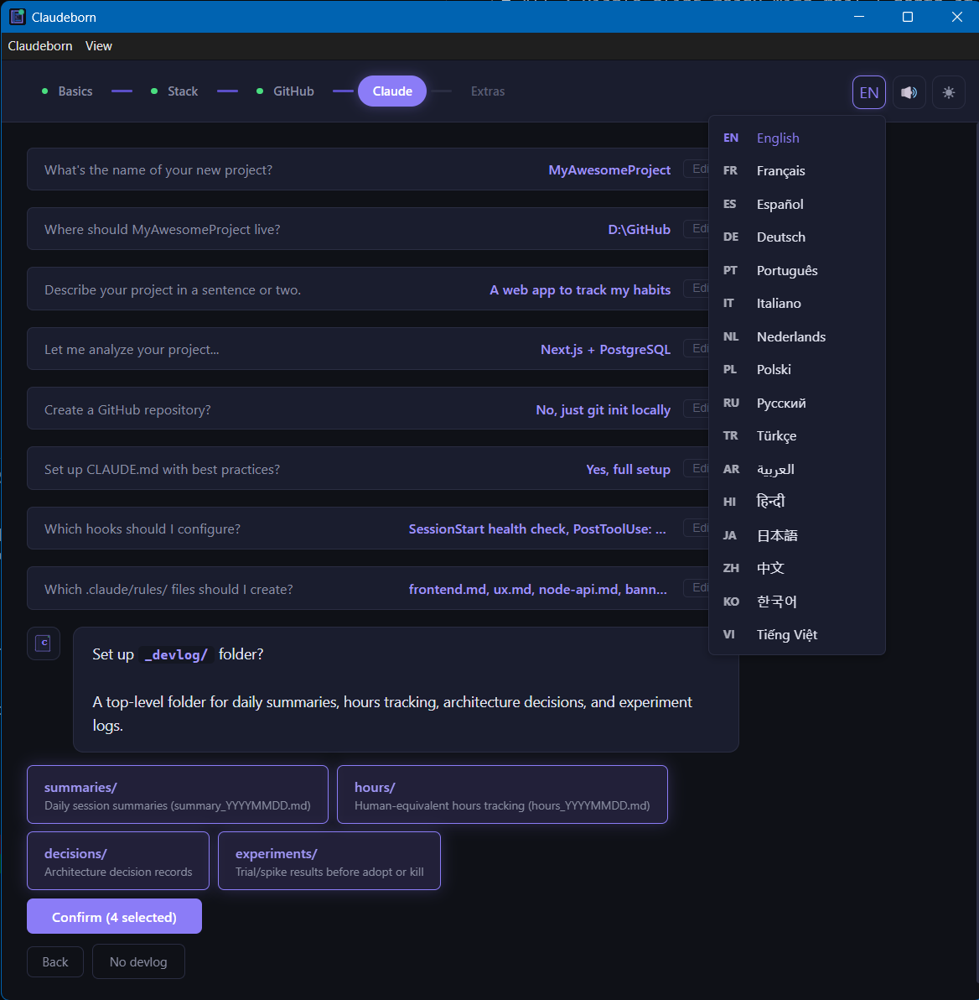
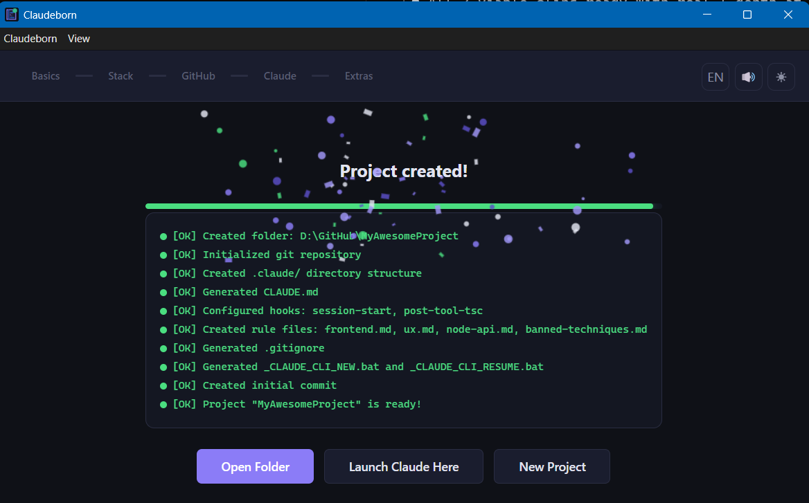

# Claudeborn

Electron wizard for bootstrapping Claude Code projects with best practices.

> *"FUS RO CLAUDE"* — shout a new project into existence.

<p align="center">
  
</p>

## Quick Start

```bash
git clone https://github.com/HAL-XP/Claudeborn.git
cd Claudeborn

# Windows
_RUN_WIZARD.bat

# macOS / Linux
chmod +x _RUN_WIZARD.sh && ./_RUN_WIZARD.sh
```

That's it. The script auto-installs dependencies on first run.

**Only prerequisite:** Node.js 18+ (you already have it if you use Claude Code CLI).

## What it does

Claudeborn walks you through setting up a new Claude Code project via an assistant-style chat interface.

### First-Run Setup

Checks prerequisites and helps you set up anything missing — all in-app.

<p align="center">
  
</p>

### Smart Stack Analysis

Describe your project, and Claude Sonnet searches the web for the latest frameworks then suggests the best tech stack, languages, styling, database, and conventions. Accept in one click or adjust manually.

<p align="center">
  
</p>

### 16 Languages

Switch languages on the fly — the entire UI translates instantly.

<p align="center">
  
</p>

### Project Creation

Everything generated in seconds — CLAUDE.md, hooks, rules, agents, devlog, scripts, .gitignore, README. With confetti and a victory fanfare.

<p align="center">
  
</p>

### Full Feature List

**Project Setup**
- LLM-powered stack analysis (Sonnet) with folder scanning
- GitHub repo creation via `gh` CLI (personal or org, public or private)
- Local `git init` fallback

**Claude Code Configuration**
- CLAUDE.md generation from [claude-cli-setup-tips](https://github.com/HAL-XP/claude-cli-setup-tips) best practices
- Stack-aware hooks (SessionStart health check, PostToolUse tsc/pycache)
- Rules directory (frontend, ux, python-api, node-api, banned-techniques)
- Agent templates (QA verifier, frontend, backend)
- Playwright MCP (`.mcp.json`)

**Project Structure**
- `_devlog/` — summaries, hours tracking, architecture decisions, experiments
- Launch scripts — `.bat` (Windows) and `.sh` (macOS/Linux)
- .gitignore, README.md, MEMORY.md seed
- PID tracking (`.claude/.pids`) for safe process management

**UI**
- Typing animation with blinking cursor
- Staggered button entrance
- Phase progress bar with glow animations
- Confetti + JRPG victory fanfare on success
- Dark/light theme toggle
- Sound effects (Web Audio API, no files)
- 16 languages (EN, FR, ES, DE, PT, IT, NL, PL, RU, TR, AR, HI, JA, ZH, KO, VI)
- Custom Scroll/Blueprint logo

## Optional Extras

| Tool | What for | Without it |
|------|----------|------------|
| `gh` CLI (authenticated) | Create GitHub repos directly | Use "just git init locally" option |
| `ANTHROPIC_API_KEY` | LLM-powered stack analysis | Falls back to manual stack selection |

### API Key Lookup

Set your key in any of these (checked in order):

1. `ANTHROPIC_API_KEY` environment variable
2. `.env` / `.env.local` in project or wizard folder
3. `~/.env`
4. `~/.claude_credentials` (`export ANTHROPIC_API_KEY="sk-ant-..."`)

## Stack

- **Electron** + **React 19** + **TypeScript**
- **Anthropic SDK** (Sonnet for stack analysis with web search)
- **electron-vite** for build tooling
- **Web Audio API** for sound effects (no audio files)
- **Canvas API** for confetti animation (no libraries)
