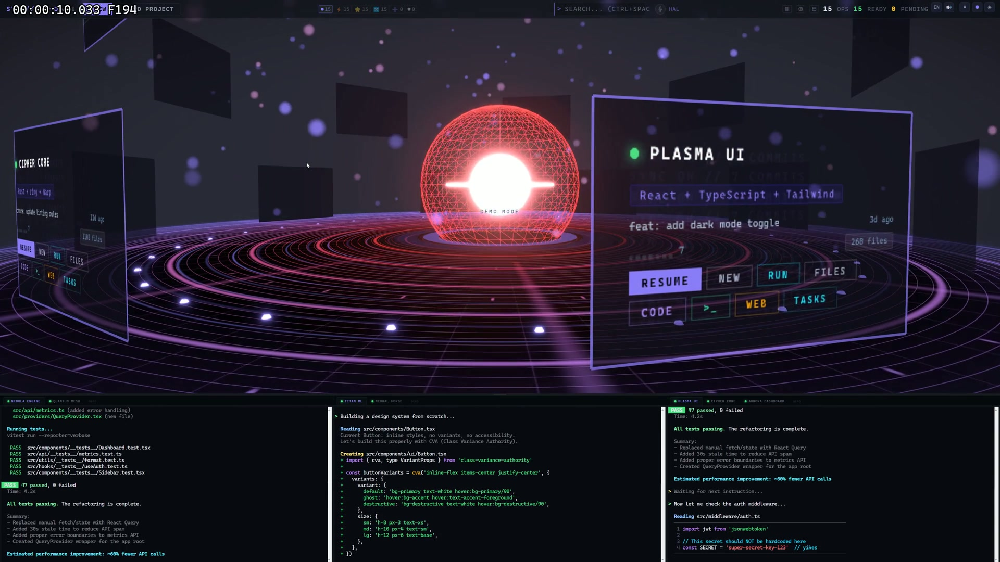
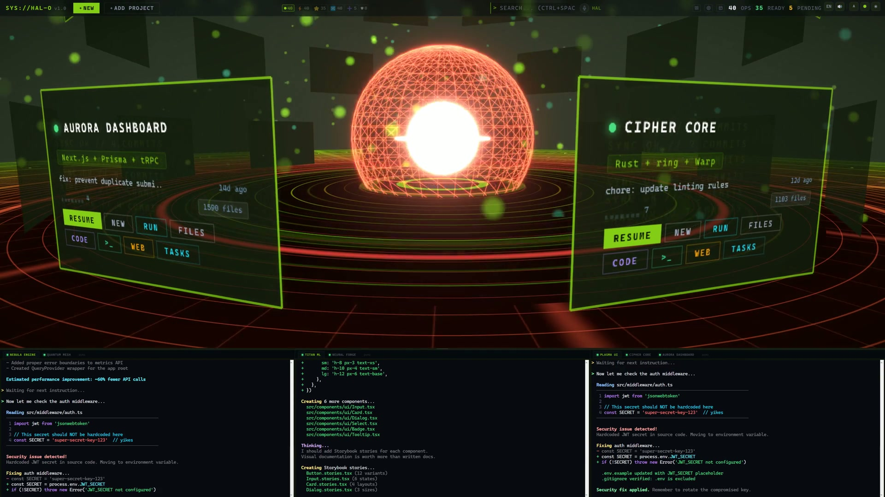
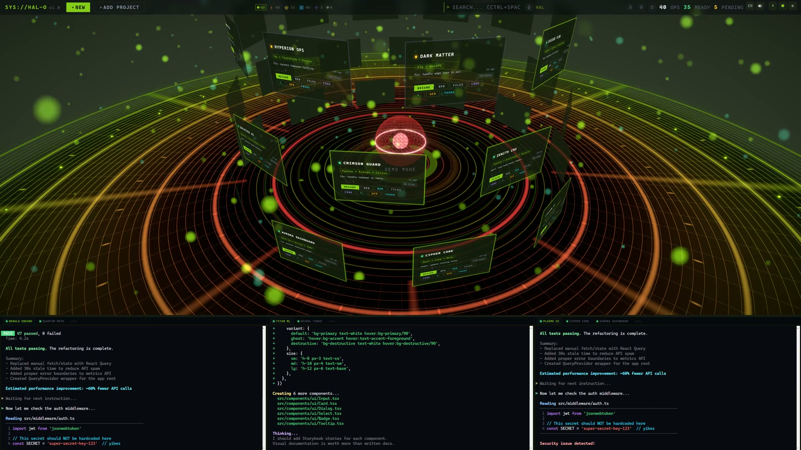

<p align="center">
  
</p>

<h1 align="center">HAL-O: Your Open Source AI Command Center</h1>

<p align="center">
  <b>H</b>olographic <b>A</b>daptive <b>L</b>ayer — <b>O</b>pen Source<br>
  <i>The O is yours — fork it, extend it, make it your own.</i>
</p>

<p align="center">
  
</p>

```bash
git clone https://github.com/HAL-XP/hal-o.git && cd hal-o && START_HERE.bat
```

---

## What is HAL-O?

A 3D holographic command center for managing your AI coding sessions. Your projects orbit a glowing sphere. You talk to them by voice. Terminals, agents, and remote control — all in one place.

Not a theme. Not a plugin. **A cockpit.**

> *Developers who enjoy their environment write better code.*

---

## Features

### Save hours, not minutes
Manage all your AI coding sessions from one screen. No more switching between terminals, IDEs, and chat windows. One voice command replaces ten clicks. Keyword shortcuts (`push`, `test`, `nuke`, `ship`) replace entire workflows. Token-optimized routing keeps API costs low.

### See all your projects at once
Holographic dashboard. Git stats pulse on every card. Health indicators at a glance. Ten 3D layouts. Double-click to jump into any session.

### Talk to your code
Ctrl+Space push-to-talk. Two voices — **Hal** and **Hallie** — with mood detection. Also works via Telegram voice messages from your phone.

### Run multiple agents, see everything
Every AI session in a visible terminal tab. Split panes, drag tabs, session persistence. Crash the app? Terminals survive. Relaunch? Sessions restore.

### Remote control via Telegram
Voice message from phone → transcribed → routed to the right project → voice reply back. Auto-AFK when you leave the desk.

### Customize everything
8 sphere styles. 6 themes. 4 tunable sliders. Personality dials. Docked settings panel — tweak while watching the scene react.

### One-click setup
`START_HERE.bat` — installs everything. Wizard scans your stack. Import any project in seconds.

---

## Screenshots

### Three Renderers

| PBR Holographic | Holographic | Classic |
|:---:|:---:|:---:|
|  |  |  |
| Full PBR, bloom, reflective floor | Lightweight 3D, ethereal feel | CSS cards, runs on anything |

### 40 Projects in Orbit
<p align="center">
  
</p>

---

<details>
<summary><h2>For Developers</h2></summary>

### Three renderers, one app

| Renderer | What it is |
|----------|-----------|
| **PBR Holographic** | Full physically-based rendering — reflective floor, bloom, chromatic aberration, vignette. The flagship experience. |
| **Holographic** | Lightweight 3D — wireframe sphere, orbital rings. Lower GPU load, same spatial layout. |
| **Classic** | CSS cards over a Three.js background. Ten switchable layouts. Runs on anything. |

### Stack

| Layer | Technology |
|-------|-----------|
| Framework | Electron 35, React 19, TypeScript |
| Build | electron-vite |
| 3D | Three.js via @react-three/fiber, drei, postprocessing |
| Terminal | xterm.js + node-pty (native PTY, not a web shell) |
| Voice STT | faster-whisper (GPU-accelerated, local) |
| Voice TTS | Chatterbox / Voicebox / Edge TTS / ElevenLabs (priority chain) |
| Tests | Playwright E2E, Docker Compose, GitHub Actions CI |
| i18n | 16 languages (EN, FR, ES, DE, PT, IT, NL, PL, RU, TR, AR, HI, JA, ZH, KO, VI) |

### Architecture

```
src/
  main/                 Electron main process
    index.ts              Window lifecycle, PID tracking, screenshot capture
    terminal-manager.ts   PTY lifecycle, 50K char scrollback buffer
    ipc-handlers.ts       All IPC: project scanning, PTY, voice, app control
    platform.ts           Cross-platform helpers

  renderer/src/
    components/
      three/              3D scenes and objects
        PbrHoloScene.tsx     PBR renderer (reflective floor, textured ring, sphere, screens, particles, HUD, ship, post-FX)
        HolographicScene.tsx Basic holographic renderer
        ScreenPanel.tsx      Project panel — git stats, activity bars, file count, health indicators
        DataParticles.tsx    Ambient particle system (cyan/green data motes)
        HudScrollText.tsx    Edge-scrolling system text with scanline effect
        SpaceshipFlyby.tsx   Procedural ship on CatmullRom path with engine trail
        SceneRoot.tsx        Classic renderer scene
      ProjectHub.tsx       Main hub — renderer switching, project display
      TerminalView.tsx     Split-pane terminal with drag-to-dock tabs
      SettingsMenu.tsx     All settings: renderer, layout, style, voice, fonts, dock
      ImportScreen.tsx     Zero-friction project import wizard
      MicButton.tsx        Push-to-talk (Ctrl+Space)
    hooks/
      useSettings.ts       Persistent settings state
      useTerminalSessions.ts Terminal session management
      useI18n.ts           Internationalization hook
    layouts.ts             10 CSS layout functions (classic renderer)
    layouts3d.ts           10 3D layout functions (PBR/holo renderers)
```

### Extending HAL-O

HAL-O is a standard Electron + React + Three.js app. No proprietary framework, no plugin API to learn.

- **Add a layout**: Export a function from `layouts3d.ts` that returns `{position, rotation}` for N screens.
- **Add a voice profile**: Drop audio samples in `~/.claude/voicebox/samples/<name>/` and add the profile to the TTS script.
- **Add a visual style**: Define a palette in the theme system (CSS variables + Three.js color bridge).
- **Add a renderer**: Create a scene component, register it in `ProjectHub.tsx`.

</details>

---

## Getting Started

### Prerequisites

- **Node.js** 18+ and **npm**
- **Git**
- **Python 3.10+** (for voice features — optional)
- **Claude CLI** (for AI features — optional)

### Install and run

```bash
git clone https://github.com/HAL-XP/hal-o.git
cd hal-o

# Windows — double-click START_HERE.bat or:
START_HERE.bat

# macOS / Linux
npm install && npm run dev
```

### Manual install

```bash
npm install
npm run dev          # Start in dev mode (hot reload)
npm run build        # Production build
npm run test         # Playwright E2E tests
```

### Import your projects

1. Launch HAL-O
2. Click **+ ADD PROJECT** and select any project folder
3. The wizard scans your stack and shows what it found
4. Pick what to add — HAL-O never overwrites existing configuration

---

## The O stands for Open Source

HAL-O is MIT licensed. The **O** in the name is deliberate — this is an open platform meant to be forked, extended, and made your own.

**Ideas for your fork:**
- Swap the holographic theme for something that matches your aesthetic
- Add voice profiles in your language
- Build project-type-specific screen panels (Kubernetes cluster view, database dashboard, CI pipeline)
- Create new 3D layouts that make sense for how you organize work
- Wire up different AI backends beyond Claude

The architecture is intentionally simple. One Electron app, one React tree, one Three.js scene graph. No microservices, no cloud dependencies, no accounts. Everything runs on your machine.

**Community compatibility:** HAL-O plays nicely with existing setups. If you already have a `CLAUDE.md`, custom rules in `.claude/rules/`, or configs from other tools (Cursor, aider, etc.) — HAL-O detects them and works alongside, never on top.

---

## License

[MIT](LICENSE)
