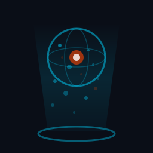
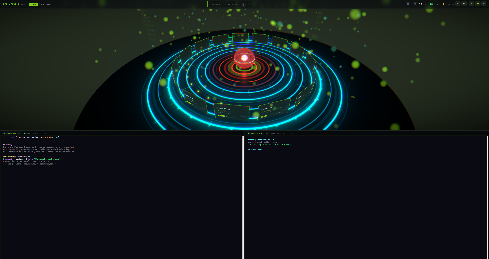
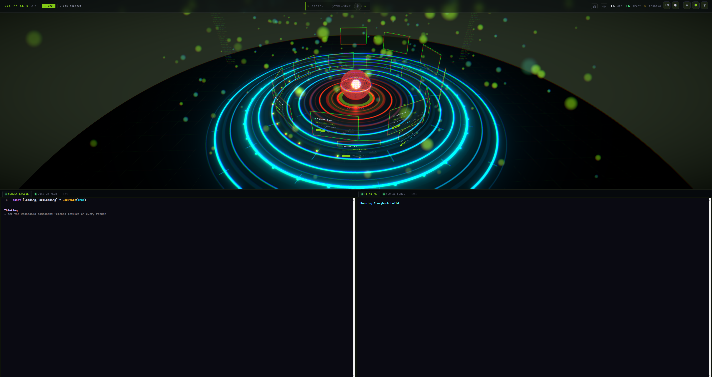
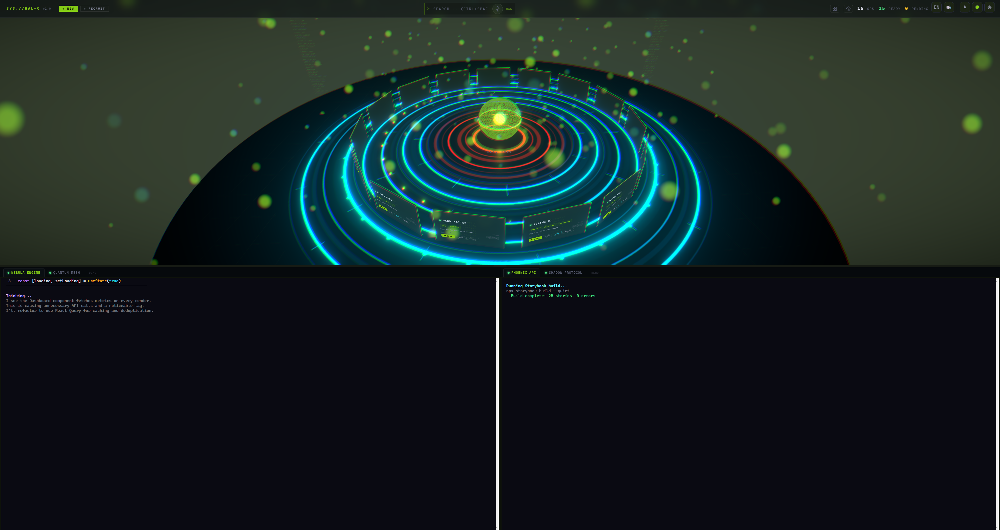

<p align="center">
  
</p>

<h1 align="center">HAL-O</h1>

<p align="center">Holographic Adaptive Layer for Claude Code projects.</p>

<p align="center">
  
</p>

## Why HAL-O?

Most developer dashboards give you a file tree and a terminal. HAL-O gives you a command center.

🎛️ **Multi-Agent Command Center** — Run multiple Claude agents side-by-side in split terminals. Dispatch work from Telegram while you're away. HAL-O bridges agents that normally can't talk to each other, turning isolated sessions into a coordinated workforce.

🎙️ **Voice-Controlled Development** — Push-to-talk with 20 cloned voice personalities, from a calm narrator to a drill sergeant. Say "Zog zog" and an orc grunt reports your build status. Terminal output auto-speaks so you can code eyes-free.

🌐 **Holographic Project Dashboard** — Your projects orbit a 3D sphere with live git stats, PBR lighting, bloom post-processing, and a reflective floor. Choose from 10 layouts, 6 visual styles, and 28 color palettes. This is not a sidebar.

⚡ **Zero-Friction Onboarding** — Import existing Claude Code projects in one click. The setup wizard auto-detects and installs git, Python, Claude CLI, and more. Nothing is overwritten — your existing config stays untouched.

🛡️ **Session Resilience** — Terminals survive renderer crashes with automatic reload. Sessions save and restore across relaunches with full scrollback. External Claude sessions can be absorbed back into the app seamlessly.

🎬 **Demo Mode** — Spin up 30 fake projects with scripted terminal feeds for presentations and screenshots. No real data, no real repos — just the full HAL-O experience without exposing anything private.

## Features

- **3 Renderers** — Classic (CSS cards + Three.js background), Holographic, and PBR Holographic (full 3D with bloom, chromatic aberration, reflective floor)
- **10 Holographic Layouts** — Default, dual-ring, stacked-rings, spiral, hemisphere, arena, grid-wall, DNA helix, cascade, constellation
- **6 3D Styles + 28 Color Palettes** — Tactical, holographic, neon, minimal, ember, arctic
- **Embedded Terminal** — xterm.js + node-pty with split panes, drag-to-dock tabs (bottom/right/left), scrollback persistence
- **Voice System** — 20 voice profiles, push-to-talk (Ctrl+Space), auto-speak terminal output
- **Project Wizard** — Create new projects or import existing ones with zero-friction enlistment
- **Setup Screen** — Auto-detect and install git, Python, Claude CLI, ffmpeg, GitHub CLI
- **Custom Project Groups** — Color-coded groups with group-aware 3D layouts
- **Demo Mode** — 30 simulated projects with scripted terminal feeds
- **16 Languages** — EN, FR, ES, DE, PT, IT, NL, PL, RU, TR, AR, HI, JA, ZH, KO, VI
- **Docker Testing** — Containerized test framework
- **CI** — GitHub Actions on Linux and Windows

## Quick Start

**Prerequisites:** Node.js 18+

```bash
git clone https://github.com/HAL-XP/hal-o.git
cd hal-o

# Windows
_RUN_WIZARD.bat

# macOS / Linux
chmod +x _RUN_WIZARD.sh && ./_RUN_WIZARD.sh
```

The script auto-installs dependencies on first run.

## Development

```bash
npm install
npm run dev          # Start in dev mode (hot reload)
npm run build        # Production build
npm run test         # Playwright E2E tests
npm run test:docker  # Run tests in Docker
```

## Screenshots

### Spiral Layout

<p align="center">
  
</p>

### Neon 3D Style

<p align="center">
  
</p>

## Architecture

```
src/
  main/              Electron main process — PTY management, IPC handlers, window lifecycle
  renderer/src/
    components/
      three/          Three.js scenes — PBR holo, classic, screen panels, sphere, starfield
      SettingsMenu    Renderer, layout, style, font, voice settings
      ProjectHub      Main hub — switches between renderers
      TerminalView    Split-pane terminal with drag-to-dock tabs
      MicButton       Push-to-talk voice input
    hooks/            useSettings, useTerminalSessions, useI18n
    layouts.ts        10 layout positioning functions
```

| Layer | Tech |
|-------|------|
| Framework | Electron 35, React 19, TypeScript |
| Build | electron-vite |
| 3D | Three.js via @react-three/fiber, drei, postprocessing |
| Terminal | xterm.js + node-pty |
| Voice | faster-whisper (STT), Chatterbox/Voicebox/Edge TTS (TTS) |
| Tests | Playwright, Docker Compose |

## License

[MIT](LICENSE)
